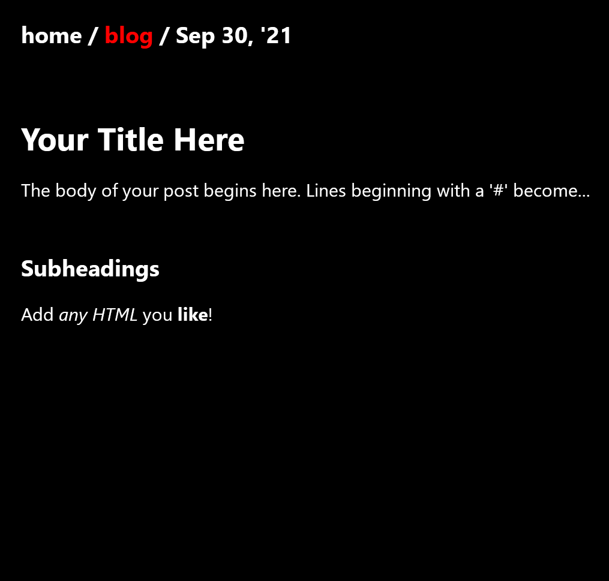

#what's up, blog?

upblog is a minimal blogging tool that converts markdown into HTML.  

run upblog.py to create (or update) a blog post. 
a sample markdown file is provided (/blog/markdown/template.md).
